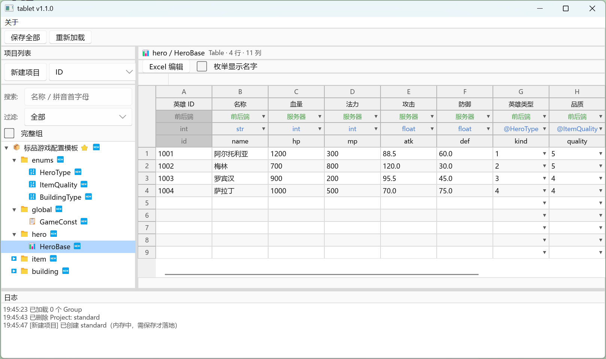

# tablet

游戏 / 应用配置表编辑工具：以 `.tbl` / `.tblschema` 为本体的可视化 + CLI 工作流，支持多 Project 树根管理、模板驱动的新建项目、12 种语言平台导出（Java / Go / C++ / C# .NET / C# Unity / C# Godot / GDScript / Lua / TypeScript / XML / JSON / ...）。

- **`tablet`**（GUI）：Slint 写的桌面端，零参数 / `--gui` 走 GUI；其它参数转 CLI fallback
- **`tablet-cli`**：纯命令行工具，Jenkins / 自动化批处理用

## v1.2.3 重大改进

- 🎯 **配置管理重构**：移除配置继承，改为模板式补全，简化配置访问路径
- 🎨 **全局设置界面**：统一管理仓库级导出配置和 UI 偏好
- ⚙️ **项目设置补齐**：新增导出配置 tab，可视化配置 27 个导出选项
- 🗂️ **导出配置细化**：
  - TypeScript 拆分为 ServerTypeScriptExport / ClientTypeScriptExport，支持 ESM/CommonJS 模块格式
  - C# 拆分为 DotNetExport / UnityCSharpExport / GodotCSharpExport，针对不同运行时优化
- 📦 **导出配置枚举化**：类型安全的枚举替换字符串字面量（CppJsonLib / ModuleKind 等）
- 🧹 **代码清理**：移除单项目模式兼容代码，统一多项目架构
- 🔧 **日志系统升级**：分级日志 + ICU4X 日志过滤优化

## GUI



四大区域：

- **顶部菜单栏 + 工具栏** —— 「关于」→「检查更新」跳转 GitHub 仓库；「保存全部」一次性提交所有 Project 的内存改动到 .tbl 文件，「重新加载」丢弃改动从磁盘重读。
- **左侧 TreeSection** —— 多 Project 树根管理：
  - 项目列表区：新建项目（模板 / 文件 / 空白三 tab） + 排序模式下拉（ID / Name / 创建时间 / 手工拖拽）
  - 搜索框支持名称 + 拼音首字母匹配；过滤下拉按状态筛（全部 / 改动 / 新增 / 修改 / 删除）
  - 节点三层：Project（🏠）→ Group（📁）→ Table（📊）/ Constant（📋）/ Enum（🔤）
  - 状态 chip：`+` 新增（绿） / `*` 修改（黄） / `-` 删除（红） / `!` 验证错（红）
- **中间 GridSection** —— Excel 风格表格编辑：
  - GridRibbon：`Excel 编辑`（调起外部 Excel/WPS/LibreOffice）+ 枚举显示名字开关
  - Table 4 行表头（desc 描述 / export 导出方向 / type 类型 / field 字段名）+ 数据区直接编辑
  - 单击进选区，双击进编辑，Ctrl+C/X/V 与 Excel 完全互通；列右键插入/删除列；行号右键插入/删除行
  - 类型选择器 / 引用选择器弹窗，支持 14 种范式（List / Set / Map / Tuple2-4 / @ref ...）
- **底部 LogPanel** —— 操作日志、验证错误、Excel 桥接事件、覆盖配置警告统一打到这里。

### 主要功能 / 操作入口

- **新建项目**：项目列表区「新建项目」按钮 → 三 tab 对话框
  - 「模板」：内置（`schemas/standard.tblschema` 等）+ 本地（`%APPDATA%/tablet/templates/`）+ 网络（占位）
  - 「文件」：导入本地 `.tblschema` 文件骨架
  - 「空白」：从零起项目
- **TreeSection 右键菜单**（按节点类型分流）：
  - **Project**（已打开）：保存 / 导出（多语言代码 + 数据）/ 导出 Schema / 导出为本地模板 / 合并 Schema / 新建 Group / 复制（克隆）/ 项目设置（身份/分隔符/导出配置）/ 关闭 / 删除 / 在文件管理器打开
  - **Project**（未打开）：打开 / 项目设置 / 在文件管理器打开 / 删除
  - **Group**：新建 Table / 新建 Constant / 新建 Enum / 用 Excel 打开（整组多 sheet xlsx）/ 复制 Group（含全部内容）/ 粘贴节点 / 粘贴 Group / 重命名 / 删除
  - **叶节点**（Table / Constant / Enum）：复制 / 粘贴 / 重命名 / 删除
  - **空白处**：新建 Group
- **GridSection 右键菜单**：
  - **列字母**（A/B/C ...）：左侧插入列 / 右侧插入列 / 删除列
  - **行号**（1/2/3 ...）：上方插入行 / 下方插入行 / 删除行
  - **单元格**：picker 弹窗（Ref / Type 列）/ 复制 / 剪切 / 粘贴 / 清空内容
- **Excel 桥接**（@06）：
  - 叶节点选中 → GridRibbon「Excel 编辑」按钮 → 单 sheet xlsx
  - Group 右键「用 Excel 打开（整组）」→ 多 sheet xlsx
  - 调起逻辑：系统默认 → 平台候选链兜底（Win Excel/WPS/LO；macOS open -a；Linux PATH）
  - 关闭探测三层降级：lock 文件 → Linux /proc fd → OS write
  - 编辑期间全屏 modal 屏蔽 UI 防止数据丢失；4h 超时自动放弃；用户可点「强制放弃」终止
- **保存与并发**：
  - 延迟写盘——编辑全部在内存，按「保存全部」才落 .tbl 文件
  - 进程锁 `.tablet.lock` + PID 检查，防多实例并发改同一 workspace
  - 树过滤器（全部 / 改动 / 新增 / 修改 / 删除）方便提交前 review
- **导出**：通过 Project 右键「导出」一次跑全部已配置的目标——12 平台（Java / Go / C++ / C# .NET / Unity / Godot / GDScript / TypeScript / Lua / JSON / XML / xlsx）；导出前自动跑验证，错则中断

完整交互细节见 [docs/04-UI设计.md](docs/04-UI设计.md)。

## CLI

`tablet-cli` 是 Jenkins / CI / 终端脚本的入口，业务逻辑与 GUI 共享同一份 core。

```bash
$ tablet-cli --help
tablet-cli v1.2.0 — TBL 配置管理工具（命令行模式）

Usage: tablet-cli [OPTIONS] <COMMAND>

Commands:
  project         项目管理 (list/info/new/rename/delete/clone)
  schema          结构操作 (show/add-*/rename-*/delete-*)
  export          导出数据/代码 (data/code/all)
  validate        验证 .tbl 文件（支持五级粒度过滤）
  excel           Excel 桥接 (export/import)
  workspace       工作区操作 (save/reload/clear)
  sep             分隔符查询
  util            底层工具（无需项目上下文）
  list-templates  列出可用模板

Options:
  -w, --workdir <WORKDIR>  工作目录 [default: .]
      --project <PROJECT>  指定 Project id（对 util 无效）
  -s, --set <KEY=VALUE>    覆盖配置项（对 util 无效）
      --fmt <FORMAT>       输出格式（json = 结构化 JSON，适用查询类命令）
```

主要功能：

| 命令组 | 用途 |
|--------|------|
| `project list/info/new/clone/rename/delete` | 多项目管理（类似 docker container 管理） |
| `schema show/add-*/rename-*/delete-*` | 项目结构增删改查 |
| `export data --json/--xml [--group/--node]` | 数据导出（支持 group/node 粒度过滤） |
| `export code --java/--go/... [--package/--namespace]` | 代码导出（支持 package/namespace 覆盖） |
| `export all` | 全量导出（CI 一把梭） |
| `validate [--group/--node/--col/--row]` | 五级粒度验证 |
| `excel export/import` | Excel 桥接（导出 xlsx 给策划编辑后回读） |
| `workspace save/reload/clear` | 工作区状态管理 |
| `sep show` | 分隔符配置查询（25 键 + 来源标注） |
| `util parse-*/validate-*/diff/fmt/stat/...` | 无上下文的单文件工具 |

**典型 CI 流水线**：

```bash
tablet-cli --project slg-prod validate || exit 1
tablet-cli --project slg-prod export all
```

完整子命令清单 + 示例见 [docs/03-CLI工程.md](docs/03-CLI工程.md)。

## 文档

完整设计与使用文档在 [`docs/`](docs/)：

- [00-概述](docs/00-概述.md) — 项目目标 / 文档导航
- [01-tbl 系统](docs/01-tbl系统.md) — `.tbl` / `.tblschema` 文件格式与硬性规则
- [02-核心功能](docs/02-核心功能.md) — Project / 模板 / 导出 / 验证 / 测试数据生成
- [03-CLI 工程](docs/03-CLI工程.md) — 源码三层、仓库布局、`tablet-cli` 子命令清单
- [04-UI 设计](docs/04-UI设计.md) — GUI 交互设计
- [05-Slint 实现](docs/05-Slint实现.md) — GUI 实现细节
- [06-Excel 桥接](docs/06-Excel桥接.md) — Excel 来回往返
- [07-开发路线](docs/07-开发路线.md) — 历史决策 / 演进记录
- [08-测试](docs/08-测试.md) — 测试体系
- [09-平台发布](docs/09-平台发布.md) — 跨平台发布策略

## AI 辅助技能

[`skills/`](skills/) 目录下提供可分发的 AI 编程技能包，拷贝到你的项目 `.claude/skills/` 目录即可让 AI 助手操作 tablet 工具链。

| 技能 | 用途 |
|------|------|
| [`skills/tbl/`](skills/tbl/) | `.tblschema` / `.tbl` 文件格式规范 + 生成/校验/扩展工作流 |
| [`skills/tbl-cli/`](skills/tbl-cli/) | `tablet-cli` / `tablet` 全部 CLI 命令操作参考 |

`tbl` 管文件内容格式，`tbl-cli` 管命令行操作，两者互补。详见 [`skills/README.md`](skills/README.md)。

## 构建

详细发布脚本见 [`scripts/README.md`](scripts/README.md)。

```bash
# 开发：dev profile（编译速度优先）
cargo build -p tablet-slint     # GUI 二进制 → target/debug/tablet[.exe]
cargo build -p tablet-cli       # CLI 二进制 → target/debug/tablet-cli[.exe]

# 发布：按宿主跑
bash scripts/release.sh host
```

## 授权

本项目按 crate 分别授权，详见 [LICENSE.md](LICENSE.md)：

| Crate | License |
|---|---|
| `tablet-core` / `tablet-cli` | [Apache-2.0](LICENSE-APACHE) |
| `tablet-slint`（GUI） | [GPL-3.0-only](LICENSE-GPL) |

GUI 静态链 [Slint](https://slint.dev/) 的 GPLv3 一支，因此 GUI 整体受 GPLv3 覆盖。**用 GUI 编辑产生的 `.tbl` 数据文件不是 GUI 的衍生作品**——和 Blender / GIMP 一样，工作流产物归用户所有，GPL 不传染。
